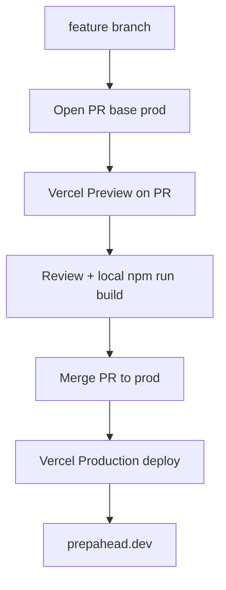

# Deploy plan — Vercel (operational)

## Objective

PrepAhead’s hosting pipeline is **live**: Vercel is linked to GitHub, the **production branch is `prod`**, and production serves **`https://prepahead.dev`**. This document is the canonical workflow for shipping changes—**PR into `prod` first**, Vercel Preview on the PR, merge, then production updates the custom domain.

It complements [`context/foundation/infrastructure.md`](../foundation/infrastructure.md) (platform decision) and [`context/foundation/tech-stack.md`](../foundation/tech-stack.md) (stack). Current app output is **static** (prerendered pages) with **on-demand** server routes under `src/pages/api/*` (each route uses `export const prerender = false`). This is **not** `output: 'hybrid'` (removed in Astro 6).

## Live configuration

| Setting | Value |
|---------|--------|
| Platform | Vercel |
| Git repo | `https://github.com/BartlomiejCzerwinski/PrepAhead.git` |
| Vercel project name | `prep-ahead-dev` (per tech-stack) |
| Production branch | **`prod`** |
| Production URL | **`https://prepahead.dev`** |
| Build command | `npm run build` |
| Node | `>=22.12.0` (match Vercel project to 22.x) |
| Deploy trigger | Push/merge to **`prod`** → Production deployment |

## Canonical workflow (PR → prod)

**Rule:** Do not push directly to `prod` for routine work. Open a PR with **base branch = `prod`**.

1. **Branch** — `git checkout prod && git pull`, then `git checkout -b feature/<short-name>`.
2. **Local gate** — `npm run build` must exit 0 before opening the PR.
3. **Pull request** — Target **`prod`**. Cite FR/US from [`prd.md`](../foundation/prd.md) when relevant. Note `npm run build` in the PR description.
4. **Preview** — Use the Vercel Preview deployment on the PR (bot comment or Deployments → Preview). Smoke-test the preview URL.
5. **Merge** — After review + green preview, merge (squash or merge commit per preference).
6. **Production** — Vercel deploys the `prod` commit; verify **`https://prepahead.dev`**.
7. **Log** — Add a row to [Execution log](#execution-log) below.

**Hotfix exception:** Urgent production fix may push directly to `prod` only when a PR is impractical; log the SHA and reason in the execution log.

## Phases (checklist)

### Phase 0 — Preconditions (every change)

- [ ] `npm run build` passes locally
- [ ] PR base is **`prod`**
- [ ] No secrets in the diff (`.env` stays gitignored)

### Phase 1 — Vercel settings verification (complete; re-check after project changes)

- [x] Vercel project linked to GitHub
- [x] Production branch: **`prod`**
- [x] Custom domain: **`prepahead.dev`**
- [ ] Node.js version **22.x** in Vercel → Settings → General
- [ ] Build: `npm run build` (do not override output directory to raw `dist/` unless build fails)
- [ ] GitHub: consider **branch protection** on `prod` (require PR, optional Vercel status check)

### Phase 2 — Preview gate (required before merge)

- [ ] Vercel Preview deployment attached to PR
- [ ] Preview URL loads (starter: Welcome page, CSS, favicon)
- [ ] Build logs show no adapter/static errors

### Phase 3 — Production (after merge to `prod`)

- [ ] Production deployment succeeded on `prod` HEAD
- [ ] `https://prepahead.dev` smoke test passes
- [ ] Execution log updated

### Phase 4 — Post-deploy

- [ ] Execution log row added
- [ ] When secrets exist: `npx vercel env pull .env.local` after `npx vercel link` (optional)

### Phase 5 — Rollback drill (when needed)

Vercel → Deployments → previous green **Production** → **Promote to Production**. Supabase data does not roll back with the app.

## Test plan

| Step | Pass criteria |
|------|----------------|
| Local build | `npm run build` exit 0 |
| Preview | PR preview URL returns 200; visible starter UI; `GET /api/health` returns 200 |
| Production | `https://prepahead.dev` returns 200; same visible UI as preview for same commit |
| Logs | No build failure; Functions tab quiet for static deploy |

## Plan rating

**Overall: 9.0 / 10** — operational pipeline ready; MVP app features not yet deployed.

| Dimension | Score | Notes |
|-----------|-------|-------|
| Stack alignment | 9/10 | `@astrojs/vercel` ^10; static build verified |
| Pipeline / hosting | 10/10 | Vercel + `prod` + prepahead.dev |
| Workflow clarity | 9/10 | Documented here (was implicit) |
| Doc coverage | 8/10 | `infrastructure.md` aligned to `prod`; deploy-plan is source for workflow |
| MVP feature readiness | 4/10 | Auth, API routes, env vars still deferred |

**Verdict:** Safe to ship **static/starter** changes via PR→`prod` now. Before JD/CV or billing on previews, complete deferred items in [What was missing](#what-was-missing).

## What was missing

Gaps identified when this plan was written (2026-05-22). Use as a backlog; check off in PRs as addressed.

### Workflow and documentation (addressed by this file)

| Item | Status |
|------|--------|
| PR→`prod` workflow not written down | **Resolved** — this file |
| `infrastructure.md` assumed branch `main` | **Resolve in foundation** — see infrastructure Getting Started |
| `AGENTS.md` had no deploy rules | **Resolve in AGENTS.md** — PR base `prod`, production URL |

### From infrastructure / tech-stack — still open

| Gap | When |
|-----|------|
| `maxDuration: 60` in `astro.config.mjs` | **Resolved (foundation)** — enabled for on-demand routes (e.g. `/api/health`) |
| `.env.example` + Vercel env scopes (Supabase, payments, models) | **Partially resolved (foundation)** — `.env.example` added (names only). Still needs env values configured in Vercel when features land |
| Deployment Protection on Vercel previews | Before real JD/CV on preview builds |
| Vercel spend / invocation alerts | Before public launch |
| Webhook idempotency design | Before Stripe webhooks |
| Supabase Auth + Postgres | MVP |
| `src/pages/api/` server routes | **Resolved (foundation)** — on-demand API routes enabled (e.g. `/api/health`) |
| shadcn/ui init | MVP UI |
| `output: 'server'` when SSR pages are introduced | Only if/when pages stop being prerendered; API routes do not require SSR pages |
| GitHub Actions deploy workflow | Only if added—**disable duplicate** Vercel Git deploy path |
| npm audit: 3 high on `@astrojs/vercel` chain | Before production secrets / heavy traffic |
| GitHub branch protection on `prod` | Recommended now |

### Repo polish (non-blocking)

| Gap | Notes |
|-----|-------|
| Root `README.md` still Astro starter boilerplate | Does not block deploy |
| No `/health` or status route | Optional later |

## Deferred (deploy wave 2 — MVP features)

Before treating production as MVP-ready:

1. Add `.env.example` (names only) and Vercel env vars (Production + Preview).
2. Set `adapter: vercel({ maxDuration: 60 })` when adding generation/Check routes.
3. Enable preview Deployment Protection when previews can show user content.
4. Implement Supabase, server endpoints, shadcn—per [`verification.md`](../changes/bootstrap-verification/verification.md) next steps.

## Execution log

| Date | PR | Merge SHA | Preview URL | Production | Notes |
|------|-----|-----------|-------------|------------|-------|
| | | | | | *Pipeline live; log each merge to `prod` here* |

## References

- [`context/foundation/infrastructure.md`](../foundation/infrastructure.md) — platform choice, rollback, secrets, risks
- [`context/foundation/tech-stack.md`](../foundation/tech-stack.md) — Astro, Vercel adapter, external Supabase
- [`context/changes/bootstrap-verification/verification.md`](../changes/bootstrap-verification/verification.md) — build proof, audit notes
- [`AGENTS.md`](../../AGENTS.md) — agent rules including deploy workflow
- [`context/foundation/prd.md`](../foundation/prd.md) — FR/US for PR descriptions
